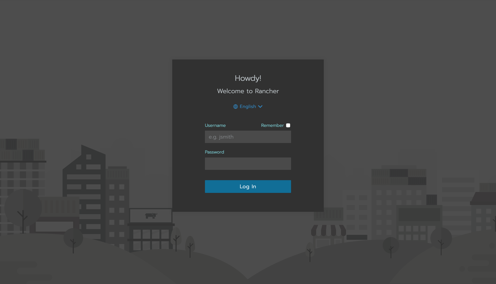
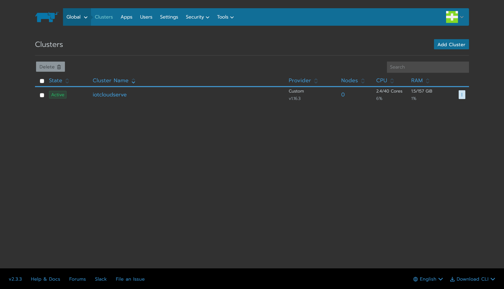
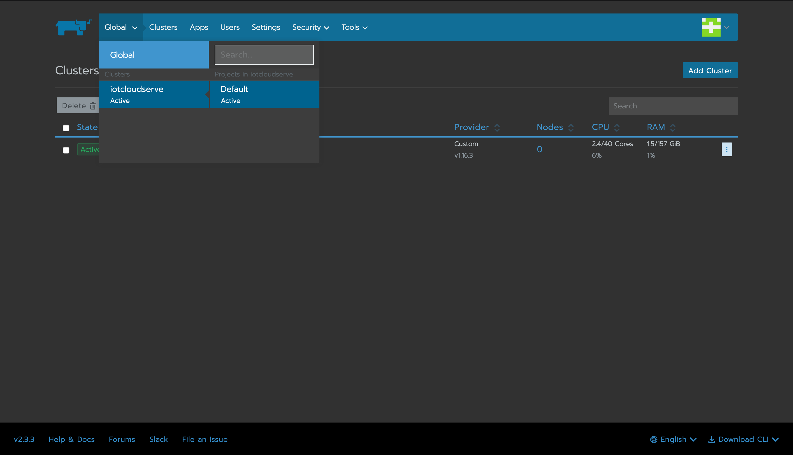

# Application deployment on rancher

## Table of Contents

- [Application deployment on rancher](#application-deployment-on-rancher)
  - [Table of Contents](#table-of-contents)
  - [Getting start with rancher](#getting-start-with-rancher)
  - [Database deployment](#database-deployment)
  - [Application deployment](#application-deployment)

## Getting start with rancher

- Go to rancher login page using information provided in class and login with your username and password

    

- After login you should see the following page
  
    

- Select project `iotcloudserve` > `Default`

    

- 

## Database deployment

## Application deployment
